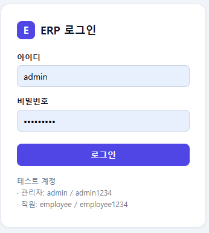
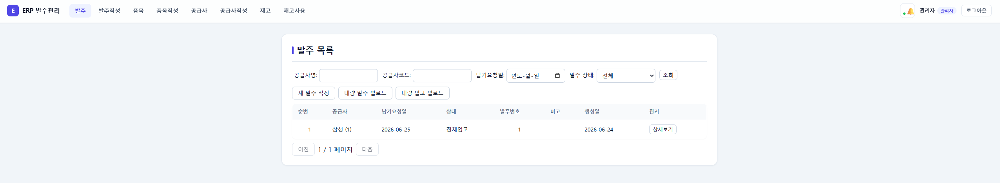
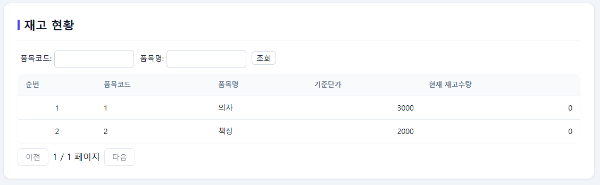
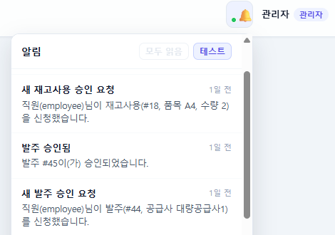
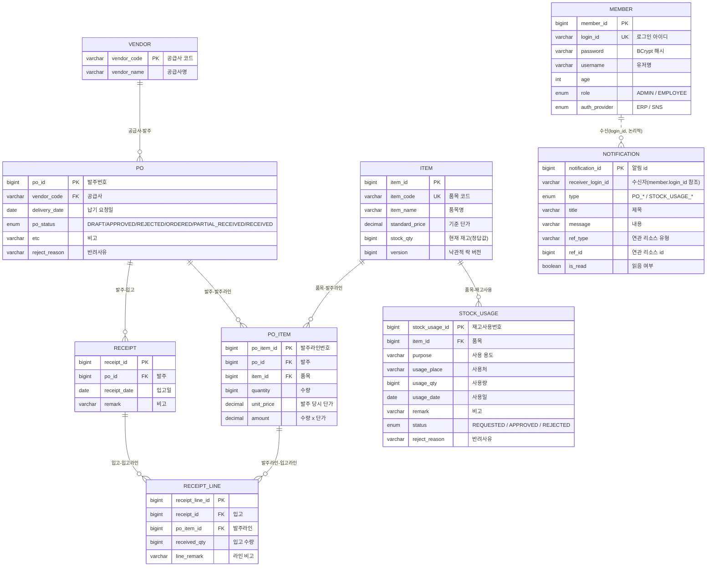
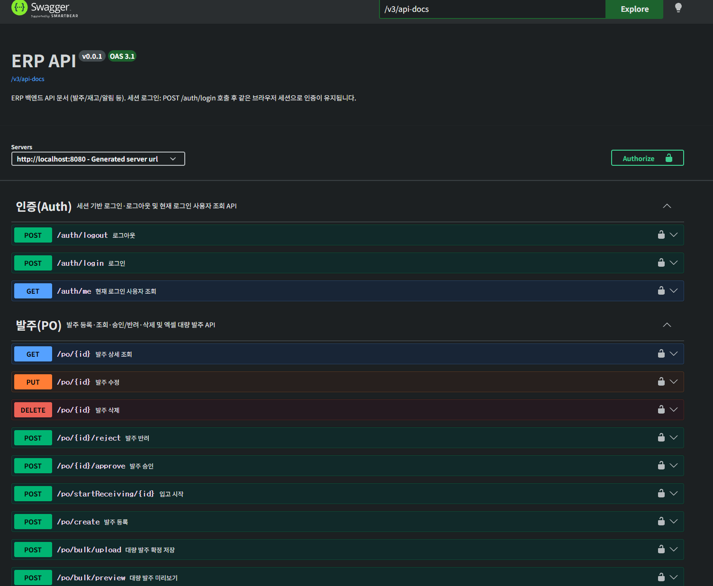

# ERP 발주·재고 관리 시스템

발주 → 입고 → 재고 → 재고 사용까지의 업무 흐름을 다루는 사내 ERP 형태의 웹 애플리케이션입니다.
결재(승인/반려) 기반 권한 분리와 재고 정합성을 실무에 가깝게 설계하는 데 초점을 뒀습니다. (개인 프로젝트 · 백엔드/프론트 전체 담당)

<!-- 배포 링크가 있다면: 🔗 데모 https://... / 데모 계정 admin / admin1234 -->






## 기술 스택

**Backend** &nbsp; Java 17 · Spring Boot 4 · Spring Data JPA · QueryDSL · Spring Security(세션) · Redis(Spring Cache) · Apache POI · springdoc-openapi · p6spy
**Database** &nbsp; MySQL(로컬) / PostgreSQL(운영)
**Test** &nbsp; JUnit 5 · Mockito · H2
**Frontend** &nbsp; React 19 · TypeScript · Vite · React Router · TanStack Query · Axios
**CI/CD** &nbsp; GitHub Actions · Render(백엔드) · GitHub Pages(프론트)

## 주요 기능

| 영역 | 내용 |
| --- | --- |
| 로그인 / 권한 | 세션 기반 로그인, 관리자/직원 권한 분리, 비로그인 시 로그인 페이지 가드 |
| 품목 / 공급사 | 등록·수정·삭제, 코드/명 중복 체크, 조건 검색 + 페이징 |
| 발주 | 작성·수정·삭제, 관리자 승인/반려, 입고 진행 전환 |
| 입고 | 발주 기준 입고 등록, 발주 대비 누적/잔량 관리, 초과입고 검증 |
| 재고 | 품목별 현재 재고 조회, 컬럼값 vs 원장 집계 대사(reconcile) |
| 재고 사용 | 사용 신청 → 관리자 승인 시 재고 차감 / 반려 |
| 실시간 알림 | 신청·승인·반려 시점에 SSE 실시간 알림 + 벨 목록/미읽음 뱃지 |
| 대량 업로드 | 발주·입고·품목·공급사 엑셀 업로드(미리보기 → 확정 저장) |

**업무 흐름**

```
발주 작성(DRAFT) → 관리자 승인(APPROVED) → 입고 진행(ORDERED)
      → 입고 등록(재고 +) → 부분/완료 입고(PARTIAL_RECEIVED/RECEIVED)
재고 사용 신청(REQUESTED) → 관리자 승인(APPROVED, 재고 −) / 반려(REJECTED)
```

승인/반려는 서버에서 `hasRole("ADMIN")`으로 잠그고 프론트에서도 버튼을 숨겨, 직원 계정의 API 직접 호출까지 차단합니다.

## 데이터 모델 (ERD)

발주(PO)를 중심으로 공급사·품목·입고·재고사용이 연결됩니다. 감사 컬럼(`created_date` / `last_modified_date` / `created_by` / `last_modified_by`)은 `BaseEntity`·`BaseTimeEntity` 상속으로 공통 적용되어 도표에서는 생략했습니다. `Notification`의 수신자는 `login_id` 문자열로 `Member`를 가리키는 **논리적 참조**(JPA FK 아님)라 점선으로 표시했습니다.



## 기술적으로 신경 쓴 부분

각 항목은 **무엇을 / 왜 / 어떻게** 순서로 정리했습니다.

**재고 정합성 설계 (계산 → 컬럼 저장 + 대사)**
초기엔 재고를 `입고합 − 승인사용합`으로 조회 시점에 계산했지만, 조회마다 집계 스캔이 필요해 `item.stock_qty` 컬럼에 현재 재고를 저장하는 방식으로 바꿨습니다. 입고·사용 승인 시 컬럼을 갱신하고, 기존 집계식은 버리지 않고 **컬럼값과 원장 집계를 비교하는 대사(reconcile) API**로 남겨 정합성을 검증합니다.

**동시성 락 (재고 음수 방지)**
동시에 재고 사용을 승인하면 재고가 음수로 내려갈 수 있습니다. `UPDATE ... SET stock_qty = stock_qty - :qty WHERE id = :id AND stock_qty >= :qty` 단일 원자적 조건부 UPDATE로 "확인 후 차감"의 경합을 제거하고(반환 0행이면 재고부족 → 롤백), 엔티티 편집 충돌은 `@Version` 낙관적 락으로 감지합니다. 재고1에 2건을 동시 승인해 1건만 성공함을 통합 테스트로 검증했습니다.

**Redis 캐싱**
품목 목록·재고 현황은 조회가 잦고 변경이 상대적으로 드물어 Spring Cache + Redis로 캐싱했습니다. `items`(TTL 10분), `stock`(TTL 30초) 두 캐시를 두고 등록/수정/입고/사용 승인 시 `@CacheEvict`로 무효화합니다. `@Cacheable` 프록시가 자기호출로 무력화되지 않도록 캐싱 메서드를 별도 빈으로 분리했습니다. (로컬/개발 프로필 전용, 운영은 Redis 미사용)

**실시간 알림 (SSE)**
발주·재고사용의 신청·승인·반려가 담당자에게 즉시 보여야 해서 SSE로 구현했습니다. 신청 시 관리자 전원, 승인·반려 시 신청자에게 push하고, 트랜잭션 커밋 이후(`AFTER_COMMIT`) 발송해 롤백된 알림이 나가지 않게 했습니다. 오프라인 대비 알림을 DB에 저장해 재접속 시 벨 목록·미읽음 뱃지로 확인할 수 있고, 25초 하트비트로 죽은 연결을 정리합니다. (인메모리 레지스트리 — 단일 인스턴스 전제)

**대용량 처리 (배치 INSERT · 엑셀)**
발주/입고 등을 한 번에 등록할 수 있게 엑셀 업로드를 제공합니다. JPA IDENTITY 전략은 insert 배치가 안 되므로 JdbcTemplate `batchUpdate`(배치 1000건)로 헤더·라인·재고를 묶어 저장하고, 한 행이라도 오류면 전체 롤백합니다. 엑셀은 Apache POI로 파싱하되 한글/영문 헤더 별칭을 매핑하고, **미리보기에서 행별 오류를 먼저 보여준 뒤 확정 저장**하는 2단계로 나눴습니다.

**쿼리 튜닝**
목록 화면이 많아 QueryDSL로 동적 검색을 짜고, 마지막 페이지에서 count 쿼리를 생략하도록 content/count 쿼리를 분리했습니다(`PageableExecutionUtils`). 상세 조회는 fetch join으로 N+1을 제거하고, 연관관계는 전부 LAZY + 목록은 DTO 프로젝션으로 필요한 컬럼만 조회합니다. 검색·조인 컬럼에는 인덱스를 명시했고, 개발 중 실제 쿼리는 p6spy로 파라미터까지 확인했습니다.

**테스트 코드**
상태 전이·재고 차감처럼 깨지면 치명적인 로직을 중심으로 작성했습니다. 엔티티 상태 전이는 순수 단위 테스트, 서비스는 Mockito로 흐름을 검증하고, 재고 원자적 차감과 동시 승인 경합은 H2 기반 `@DataJpaTest`·통합 테스트로 실제 커밋/롤백을 관찰합니다. H2를 써서 외부 DB 없이 `./gradlew test`로 돌아갑니다.

**CI/CD 파이프라인**
`main` push마다 GitHub Actions가 테스트 → 빌드를 돌리고(`.github/workflows/ci-cd.yml`), 통과 시 백엔드는 Render Deploy Hook으로, 프론트는 `gh-pages`로 GitHub Pages에 자동 배포합니다.

**API 문서화 (Swagger)**
springdoc-openapi로 컨트롤러에서 API 명세를 자동 생성합니다(`/swagger-ui.html`). 세션 로그인 후 브라우저 쿠키로 인증이 필요한 API도 바로 테스트할 수 있게 쿠키 인증을 설정했고, 명세가 외부에 노출되지 않도록 **운영 프로필에서는 비활성화**했습니다.



## 실행 방법

사전 준비: JDK 17, Node.js, MySQL(`erp` 스키마 생성), Redis(로컬 캐싱용). DB 접속 정보는 환경변수로 주입합니다.

```bash
# 백엔드 (http://localhost:8080)
cd backEnd/backEnd
export DB_USERNAME=root
export DB_PASSWORD=본인_비밀번호
./gradlew bootRun
```

```bash
# 프론트엔드 (http://localhost:5173)
cd backEnd/frontEnd
npm install
npm run dev
```

```bash
# 백엔드 테스트 (H2 기반, 외부 DB 불필요)
cd backEnd/backEnd && ./gradlew test
```

최초 기동 시 데모 계정이 자동 생성됩니다.

| 권한 | 아이디 | 비밀번호 |
| --- | --- | --- |
| 관리자 | admin | admin1234 |
| 직원 | employee | employee1234 |
